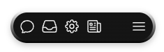

## Defining CSS variables

We will define some CSS variables for the background -

```css
:root {
  --bg: color-mix(in hsl, canvas 8%, canvasText);
  --color: color-mix(in hsl, canvas 92%, canvasText);
}
```

We use [`color-mix`](https://developer.mozilla.org/en-US/docs/Web/CSS/color_value/color-mix).

> The color-mix() functional notation takes two <color> values and returns the result of mixing them in a given colorspace by a given amount.

It is a new css feature that gets the color spacing (`in hsl`) and colors as param -
and it mix them to get a final color.

[`canvasText`](https://developer.mozilla.org/en-US/docs/Web/CSS/system-color#canvastext) is a keyword the get the text color in application content or documents.
So the result will be 8% the color of `canvas` and 92% of `canvasText` - which is a dark gray `#151515`.
The `--color` variable resolves its the complement which is light gray `#EBEBEB`.

## Defining utility classes

We are going to define some utility classes.

```css
@layer utilities {
  .text-primary {
    font-size: var(--color);
  }

  .shadow-primary {
    box-shadow: 0 4px 8px 0 hsl(0 0% 0% / 0.2);
  }
}
```

The shadow will appear slightly below the element (4px down), be soft and blurry (8px blur), and have a subtle, semi-transparent black color (hsl(0 0% 0% / 0.2)).

We add this class to the `utilities` layer,
which means it declared after `base` and `components` CSS classes and can override them.

We could do the same thing in tailwind using other techniques:

- Arbitrary values: `shadow-[0_4px_8px_0_hsl(0_0%_0%_/_0.2)]`
- Arbitrary values using CSS variables: `shadow-[var(--shadow)]` and declare

```css
@layer utilities {
  :root {
    --shadow: 0 4px 8px 0 hsl(0 0% 0% / 0.2);
  }
}
```

- Declare a custom `boxShadow` variant in tailwind config like (which is preferred)

```ts
export default {
  theme: {
    extend: {
      boxShadow: {
        primary: "0 4px 8px 0 hsl(0 0% 0% / 0.2)",
      },
      colors: {
        primary: "var(--color)",
      },
    },
  },
};
```

and use `box-custom` class.
Setting it in the TailwindCSS config is my favorite way, but for simplicity I use utility class.

### Background

We will create another utility for the background of the navbar.
This time - it's harder to create using TailwindCSS - so I created a utility class.
Notice that the `background` property have 2 layers.
The order is from the bottom to the top - means that the second one covers the first.
We have `padding-box` and `border-box` as `background-origin`s.

```css
@layer utilities {
  .bg-primary {
    background:
      linear-gradient(var(--bg), var(--bg)) padding-box,
      linear-gradient(white, black) border-box;
  }
}
```

We could write it as

```css
@layer utilities {
  .bg-primary {
    background-image:
      linear-gradient(var(--bg), var(--bg)),
      /* First layer */ linear-gradient(white, black); /* Second layer */

    background-origin:
      padding-box,
      /* First layer applies to padding box */ border-box; /* Second layer applies to border box */
  }
}
```

The first background applies to the **padding box** (inside the border). The second background applies to the **border box** (including the border).

Because we have a transparent border and border-radius we will have a cool background effect that that has gradient on the edges.
If we increase the border width to 4px instead of 1px we would be able the see this effect better:


